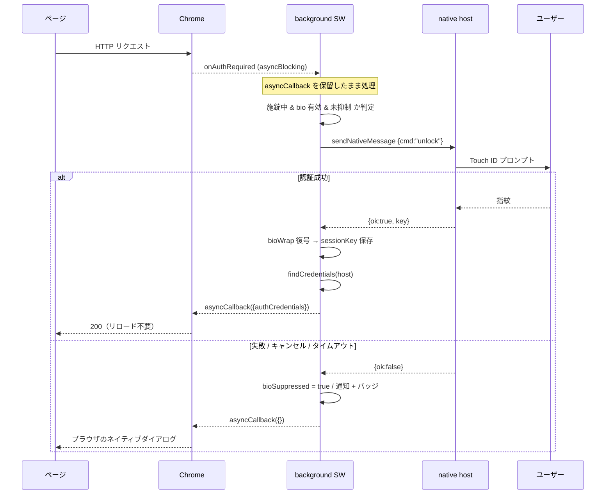

# 詳細設計 — v0.3.0

「何を作るか」は [`../PROJECT_SPEC.md`](../PROJECT_SPEC.md)。本書は**どう作るか**だけを扱う。
機能 ID（F-01…）・受け入れ条件 ID（AC-01-1…）は spec のものを参照する。

## 適用セクションと除外

| セクション | 扱い |
|---|---|
| 1. 開発環境・規約 | 実施（本書 §1 + `../README.md` + `eslint.config.js`） |
| 2. DB 詳細設計 | **除外** — RDB を持たない。`chrome.storage` のキー設計を §2 で代替 |
| 3. モジュール / 処理設計 | 実施（§3〜§6）— 本 v0.3.0 の主戦場 |
| 4. インターフェース設計 | 実施（§7）— HTTP API は無いので OpenAPI は不要。拡張内メッセージと Native Messaging の契約を記述 |
| 5. インフラ詳細 | **除外** — サーバもデプロイ対象も無い。ネイティブホストの導入は既存 `native/install.sh` が担う |
| 6. テスト設計 | 実施（§8） |
| 7. タスク分解 | 実施 — `~/Documents/claude-shared/basic-auth-autofill/tasks.md`（repo 外） |

---

## 1. 開発環境・規約

拡張本体は **ビルド不要**のまま（`chrome://extensions` に unpacked で読み込めば動く）。
Node のツールチェーンは**開発時のみ**で、配布物には一切影響しない。

| 項目 | 決定 |
|---|---|
| パッケージマネージャ | pnpm（`pnpm-workspace.yaml` に `minimumReleaseAge` / `trustPolicy`） |
| Lint | ESLint 9 flat config（`eslint.config.js`）。`extension/src/` は browser + webextensions、`test/` `tools/` は node |
| テスト | `node --test "test/**/*.test.js"`（依存ゼロ。Node 標準ランナー） |
| typecheck / build | 無し（素の ES モジュール） |
| 整形 | Prettier は入れない。ESLint の `prefer-const` / `no-var` 等で最低限だけ縛る |

### ディレクトリの責務

```
extension/            ← Chrome が読むのはここだけ（v0.3.1 で分離）
  manifest.json
  src/crypto.js       WebCrypto ラッパ。chrome.* に依存しない
  src/transfer.js     エクスポート/インポートの純粋ロジック。chrome.* に依存しない
  src/vault.js        金庫。chrome.storage と native に依存
  src/native.js       Native Messaging ラッパ
  src/background.js   Service Worker。onAuthRequired・自動解錠・バッジ/通知
  src/popup.*         ポップアップ
  src/options.*       設定画面。ファイル入出力の DOM 操作はここに閉じる
  icons/              拡張アイコン。tools/gen-icons.js で再生成できる
tools/                開発用スクリプト（アイコン生成・拡張 ID 算出・401 サーバ）
test/                 node --test 対象。extension/src/ の純粋モジュールのみ
node_modules/         eslint のみ。**extension/ の中には絶対に置かない**
```

**`extension/` とリポジトリルートの分離**が構成上の第一の線。Chrome の unpacked 読み込みは
指定ディレクトリ配下を全走査するため、`node_modules`（1836 ファイル・シンボリックリンク 192 本）が
同居していると起動時の読み込みが通らず、**再起動のたびに拡張が消える**。v0.3.0 の開発中に
実際に踏んだ（`2026-08-08_拡張が再起動で消える.md`）。

**`chrome.*` 依存の境界**が本設計の要。`crypto.js` と `transfer.js` は `chrome.*` を一切参照しない
（Node でそのままテストできる）。ファイル選択・ダウンロード・DOM は `options.js` 側に閉じる。

---

## 2. ストレージ設計（DB 詳細設計の代替）

| 領域 | キー | 内容 | 寿命 |
|---|---|---|---|
| `storage.local` | `vault` | `{salt, iv, ct}`。復号すると `{entries: Entry[]}` | 永続 |
| `storage.local` | `bioWrap` | `{iv, ct}`。金庫鍵を生体鍵で包んだ封筒 | 永続 |
| `storage.session` | `sessionKey` | 金庫鍵の raw(base64) | ブラウザ終了で消滅 |
| `storage.session` | `bioSuppressed` | `true` = 自動解錠の再試行を抑制中【新規】 | ブラウザ終了で消滅 |

### `bioSuppressed` を `storage.session` に置く理由

MV3 の Service Worker はアイドル数十秒で停止し、モジュールスコープの変数は消える。
抑制フラグをメモリに持つと、SW が一度落ちただけで抑制が解除され、AC-04-3（明示解錠まで再試行しない）
を満たせない。`storage.session` ならブラウザが生きている限り残り、終了で消えるので寿命も要求どおり。

既存の `attempted` Map（同一リクエストの資格情報再送防止）は、リクエストの生存期間内でしか
意味を持たないためメモリのままでよい。

---

## 3. F-01 / F-02 — `extension/src/transfer.js`

### ファイルフォーマット

```jsonc
// 暗号化
{ "kind": "basic-auth-autofill-export", "v": 1,
  "salt": "<b64>", "iv": "<b64>", "ct": "<b64>" }

// 平文
{ "kind": "basic-auth-autofill-export", "v": 1,
  "plaintext": true, "entries": [ { "host": "...", "username": "...", "password": "...", "label": "..." } ] }
```

鍵導出は既存の `crypto.js#deriveKey`（PBKDF2-SHA256 250k）をそのまま使う。**エクスポートごとに
新しい salt を引く**（金庫の salt は流用しない）。新しい暗号コードは書かない。

### API

```js
export const EXPORT_KIND = "basic-auth-autofill-export";
export const EXPORT_VERSION = 1;

export async function buildEncryptedExport(entries, passphrase); // -> ファイルオブジェクト
export function        buildPlainExport(entries);                // -> ファイルオブジェクト
export async function  parseImport(fileObj, passphrase);         // -> Entry[]
export function        mergeEntries(existing, incoming, overwriteHosts); // 純粋関数
```

`parseImport` が投げるエラー（`Error.message` で分岐する。既存 vault.js の流儀に合わせる）:

| message | 条件 |
|---|---|
| `BAD_FORMAT` | JSON でない / `kind` が一致しない |
| `BAD_VERSION` | `v` が `EXPORT_VERSION` と一致しない |
| `WRONG_PASSPHRASE` | AES-GCM 復号が失敗（`OperationError`） |

### `mergeEntries` — 2 パスで使う純粋関数

```js
mergeEntries(existing, incoming, overwriteHosts = new Set())
// -> { next, added: string[], skipped: string[], overwritten: string[], conflicts: string[] }
```

- `incoming` の各エントリについて、同じ `host` が `existing` に無ければ **added**
- あって `overwriteHosts` に含まれれば **overwritten**（`existing` 側を置換）
- あって含まれなければ **skipped**（`existing` 側を維持）
- `conflicts` は上書き有無に関わらず**衝突した host 全部**

呼び出し側は 2 回呼ぶ。

1. `overwriteHosts` 空で呼ぶ → `conflicts` を UI に出して利用者に選ばせる（AC-02-3）
2. 選択結果を `overwriteHosts` に入れて呼び直す → `next` を保存し、件数をサマリ表示（AC-02-4）

副作用が無いので 1 回目の結果を捨てても安全で、テストも書きやすい。

### UI 側（`options.js`）の責務

- **エクスポート**: エントリ一覧の各行にチェックボックス（既定は全選択）。パスフレーズ入力欄。
  平文チェックを入れた場合は `confirm()` を挟む（AC-01-4）。
  出力は `Blob` + `URL.createObjectURL` + `<a download>`。`downloads` 権限は不要。
  ファイル名 `basic-auth-autofill-YYYY-MM-DD.json` /（平文時）`...-PLAINTEXT.json`
- **インポート**: `<input type="file" accept="application/json">` → `File.text()` → `JSON.parse`。
  `plaintext: true` ならパスフレーズを聞かない。衝突があれば一覧＋チェックボックスを出す
- **施錠中**: エクスポート／インポートのボタンを `disabled` にし、理由を併記（AC-01-5 / AC-02-5）

---

## 4. F-04 — Touch ID 自動解錠（リクエスト保留方式）

v0.2.0 は解錠と認証処理が分離しており、Touch ID で解錠してもそのリクエストには資格情報が渡らず
リロードが要った。v0.3.0 は `asyncBlocking` のコールバックを保留して同じリクエストを通す。

### 処理フロー



### 単一飛行（single-flight）— 仕様に無いが必須

1 ページに 401 を返すサブリソースが複数あると `onAuthRequired` が同時に複数発火する。
素直に書くと **Touch ID プロンプトが同時に何枚も出て操作不能になる**。
モジュールスコープに解錠中の Promise を 1 本持ち、後続はそれを await して結果を共有する。

```js
let unlockInFlight = null; // Promise<boolean> | null

async function tryBioUnlock() {
  if (!(await isBioEnabled())) return false;
  if (await isSuppressed()) return false;
  if (!unlockInFlight) {
    unlockInFlight = withTimeout(unlockWithBio(), BIO_TIMEOUT_MS)
      .then(() => true)
      .catch(async () => { await suppress(); await notifyFailure(); return false; })
      .finally(() => { unlockInFlight = null });
  }
  return unlockInFlight;
}
```

`unlockInFlight` はメモリでよい。SW が停止するのは全リクエストが片付いた後であり、
停止＝飛行中の認証が無いということだから。

### 既知の割り切り — 未登録ホストでも Touch ID を出す

施錠中は「この host の資格情報を持っているか」を**知る手段が無い**（判定に金庫の復号が要り、
復号には解錠が要る）。したがって未登録のサイトで 401 に遭遇しても Touch ID が出る。

回避するにはホスト一覧を平文で持つ必要があり、「どのサイトの資格情報を持っているか」が
漏れる。Basic 認証に遭遇すること自体が稀で、かつ 1 度キャンセルすれば抑制が効いて
明示解錠まで再び出ないため（AC-04-3）、実害は限定的と判断してこのまま採る。

### タイムアウト（AC-04-4）— T-001 で実測済み

```js
const BIO_TIMEOUT_MS = 15_000;
```

**計測結果（2026-08-07, Chrome / macOS）**

| 観測 | 結果 |
|---|---|
| Chrome が `asyncCallback` を待つ上限 | **180 秒でも諦めない**。`onErrorOccurred` は発火せず、コールバックは例外なく受理された |
| MV3 Service Worker の寿命 | **保留中は停止しない**。180 秒通して再起動ログなし。アイドル 30 秒での停止はこの経路では効かない |
| 保留後に認証が通るか | **通る**。ローカルサーバ相手に 15 秒保留 → `status=200` / `authenticated: true` |

**実際の制約は Chrome ではなくオリジンサーバ側にあった。** 1 回目の計測（httpbin.org 相手に 180 秒保留）は
`onCompleted status=503` で終わった。`onErrorOccurred` に `net::ERR_*` が出ていない以上、この 503 は
ワイヤを通って返ってきたもので、長時間保留された**サーバ側が先に接続を諦めた**跡である。
nginx の `keepalive_timeout` は既定 75 秒、Apache の `Timeout` は既定 60 秒。

したがって `BIO_TIMEOUT_MS` は「Chrome の上限を避ける値」ではなく
**「どのサーバ設定でも確実に間に合う値」**として決める。Touch ID のタップは実測 1〜5 秒なので
15 秒は人間に十分な猶予があり、一般的なサーバのタイムアウトより十分下にある。

自前のタイムアウトを持つ意味は残る — ネイティブホストが無応答になったときにリクエストを
宙吊りにせず、確実にブラウザのダイアログへ落とすため。

> 手動検証用のローカル 401 サーバを `tools/local-401-server.js` に残してある。
> リクエストごとに realm を変えるので Chrome の認証キャッシュを回避でき、再起動なしで何度でも試せる。
> `/forecast` の F-04 シナリオもこれを使う。

### 抑制と復帰（AC-04-3 / AC-04-5）

- 失敗時: `storage.session.bioSuppressed = true`、通知 1 回、バッジ `!`（赤）を点灯
- 復帰: `chrome.storage.onChanged`（area `session`）で `sessionKey` の出現を検知したら
  バッジを消し `bioSuppressed` を落とす

ポップアップからの明示解錠は `storage.session` に `sessionKey` を書くので、この 1 本の監視で
「明示解錠したときだけ復帰する」という要求を満たせる。popup と background に復帰処理を
二重に書かずに済む。

### 通知（AC-04-2）

`chrome.notifications.create` は `type: "basic"` で **`iconUrl` が必須**。
そのためアイコン同梱（`icons/icon-128.png`）が F-04 の前提条件になる（→ タスク T-002）。

```js
chrome.notifications.create("bio-unlock-failed", {
  type: "basic",
  iconUrl: "/icons/icon-128.png",
  title: "解錠できませんでした",
  message: "拡張アイコンから解錠してから、ページを再読み込みしてください。",
});
```

---

## 5. F-03 — 拡張 ID の固定

### 鍵の生成

```sh
openssl genrsa 2048 > ~/.ssh/basic-auth-autofill-key.pem   # repo 外に保管
openssl rsa -in ~/.ssh/basic-auth-autofill-key.pem -pubout -outform DER | base64 | tr -d '\n'
```

出力を `manifest.json` の `"key"` に入れる。秘密鍵はコミットしない（`.gitignore` ではなく
**そもそも repo 外に置く**）。今回 .crx 署名はしないので秘密鍵は当面使わないが、
将来 .crx 配布に切り替える可能性があるため破棄しない。

### ID の算出

拡張 ID は「DER 公開鍵の SHA-256 の先頭 16 バイトを、各ニブル `0-f` → `a-p` に写像したもの」。
`tools/ext-id.js` で manifest の `key` から算出して表示する。読み込む前に ID が分かるので、
`native/install.sh <拡張ID>` と README の記述を先に確定できる。

### 移行に伴う破壊

`key` を入れた瞬間に ID が変わり、既存の `storage.local` は参照できなくなる。開発中も同じなので
**T-006 は開発の早い段階で通す**（テストデータが少ないうちに 1 度だけ痛みを受ける）。
`key` 投入後は `native/install.sh` を新 ID で再実行しないと Touch ID が動かない。

---

## 6. F-06 — プラットフォーム判定

```js
const { os } = await chrome.runtime.getPlatformInfo(); // MV3 は Promise を返す
if (os !== "mac") { /* Touch ID セクションを非表示 */ }
```

- `options.js`: Touch ID の `<section>` ごと `hidden`
- `popup.js`: `bio-unlock-btn` を `hidden`（現状は `isBioEnabled()` だけで判定している箇所）

判定は非同期なので、初回描画で一瞬見えないよう **HTML 側の初期状態を `hidden` にしておき、
mac と判明した場合だけ外す**。

---

## 7. インターフェース設計

### 拡張内メッセージ（popup / options → background）

| type | 引数 | 応答 | 用途 |
|---|---|---|---|
| `BIO_UNLOCK` | — | `{ok:true}` / `{ok:false, error}` | ポップアップからの明示的な Touch ID 解錠（既存） |

v0.3.0 で新しいメッセージ型は追加しない。エクスポート／インポートは options ページが
`vault.js` を直接呼ぶ（背景に置く理由が無い）。

### Native Messaging

`native/src/main.swift` の契約（`status` / `enroll` / `unlock` / `reset`）は **変更しない**。
v0.3.0 で Swift 側に手は入らない。

---

## 8. テスト設計

spec の検証方針は「手動シナリオ中心」。ただし `transfer.js` は `chrome.*` に依存しない純粋
モジュールとして設計したため、**Node 標準ランナーで依存ゼロのまま自動化できる**。
テスト基盤の新設コストが発生しないので、ここだけ自動テストを置く。

### 自動（`node --test test/`）

テスト名に機能 ID を刻む（`weathering` が「テストのない v1 機能」を機械検出できる）。

| 受け入れ条件 | テスト |
|---|---|
| AC-01-2 | パスフレーズ空でエクスポートが失敗する / 暗号化ラウンドトリップが復元できる |
| AC-01-3 | 出力に `kind` と `v` が入り、`bioWrap` 等が混ざらない |
| AC-02-1 | 誤ったパスフレーズで `WRONG_PASSPHRASE` を投げる |
| AC-02-2 | `kind` 不一致で `BAD_FORMAT` / `v` 不一致で `BAD_VERSION` |
| AC-02-3 | 衝突時に既定でスキップ / `overwriteHosts` 指定で上書き / `conflicts` が全衝突を列挙 |
| AC-02-4 | added / skipped / overwritten の件数が正しい |

`crypto.subtle` と `btoa` / `atob` は Node 24 のグローバルに存在するため、`crypto.js` も
そのまま import できる。

### 手動のみ（`/forecast` のシナリオで拾う）

自動化しない理由を明示する。

| 受け入れ条件 | 理由 |
|---|---|
| AC-01-1 / AC-01-4 / AC-01-5 | DOM 操作・ファイルダウンロード・`confirm()` |
| AC-02-5 | 未初期化状態の UI 遷移 |
| AC-03-1 / AC-03-2 / AC-03-3 | Chrome への読み込み結果とドキュメント |
| AC-04-1〜AC-04-5 | Touch ID の実プロンプト・Chrome の待ち時間・通知/バッジの実表示 |
| AC-06-1 / AC-06-2 | 非 macOS 環境が必要 |

**v1 の全機能 ID が「自動あり」か「手動のみ（理由つき）」に割り付いている**:
F-01・F-02 は自動＋手動、F-03・F-04・F-06 は手動のみ。

---

## 9. 例外・状態遷移

### 金庫の状態

```
未初期化 ──initVault──> 解錠済み ──lock──> 施錠中
                          ↑                  │
                          └── unlock ────────┤
                          └── unlockWithBio ─┘
```

`bioSuppressed` は「施錠中」でのみ意味を持ち、`sessionKey` の出現で必ず落ちる。

### 自動解錠が呼ばれない条件（すべて「ブラウザのダイアログに委ねる」に落ちる）

1. `details.isProxy` が真（スコープ外）
2. 同一 `requestId` で 2 回目（誤資格情報のループ防止・既存）
3. URL から host が取れない
4. Touch ID 未設定（`bioWrap` 無し）
5. `bioSuppressed` が真
6. 認証失敗・キャンセル・`BIO_TIMEOUT_MS` 超過
7. 解錠できたが該当 host のエントリが無い

### `BIO_KEY_MISMATCH`

生体鍵が再 enroll で変わると `unlockWithBio` が `bioWrap` を破棄して投げる（既存挙動）。
自動解錠経路では通常の失敗と同様に扱う（抑制＋通知）。通知文面は共通で構わない —
利用者の次の行動が「拡張アイコンから解錠する」で同じため。
